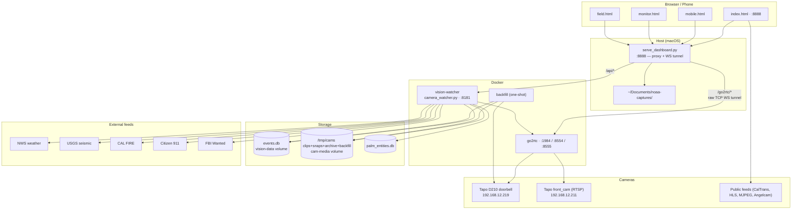
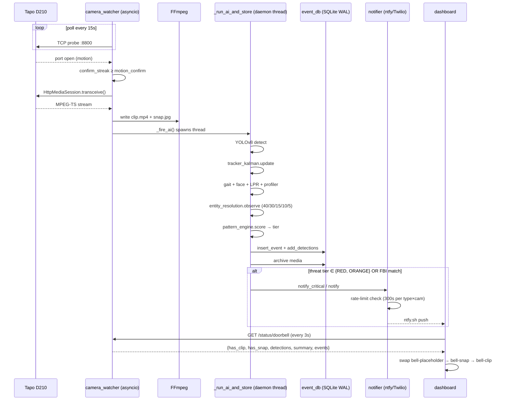

# PALM COMMAND — Codebase Map

> Auto-generated by Cartographer (4 parallel Sonnet scouts). Last mapped: 2026-05-20T01:59:38Z

Palantir-style home surveillance dashboard. Docker stack (go2rtc + vision-watcher) fronted by a Python stdlib proxy. Multi-modal person re-identification fuses face (40%), gait (30%), appearance (15%), spatial (10%), and profile alias (5%). Real-time YOLOv8 detection feeds an event database that drives a tactical dashboard, mobile PWA, fullscreen monitor, and a Field Scan LPR/face app.

## System Overview



## Ports

| Port | Service | Notes |
|---|---|---|
| 8888 | `serve_dashboard.py` proxy | Entry point; `/api/*` → :8181, `/go2rtc/*` → :1984 raw TCP, `/noaa/*` → local dir, `/dashboard/*` static |
| 8181 | `camera_watcher.py` HTTP API | ~35 endpoints, ThreadingHTTPServer |
| 1984 | go2rtc | HTTP API, WebRTC/MSE bridge |
| 8554 | go2rtc RTSP | Stream relay |
| 8555 | go2rtc TCP+UDP | WebRTC |
| 8800 | Tapo D210 doorbell | Direct device port (pytapo HttpMediaSession) |

## Directory Structure

```
~/palm-command/
├── camera_watcher.py        ← main asyncio orchestrator + :8181 HTTP
├── serve_dashboard.py       ← :8888 proxy, raw TCP WS tunnel
├── ai_engine.py             ← YOLOv8 detect + 64-dim appearance embedding
├── tracker_kalman.py        ← ByteTrack 6D Kalman + Hungarian
├── profiler.py              ← person re-ID, cosine match, auto-merge
├── gait_engine.py           ← YOLOv8-pose → 18-dim gait vector
├── face_intel.py            ← FBI Most Wanted + POI, 80-dim face vector
├── lpr_engine.py            ← EasyOCR plate read + watchlist
├── entity_resolution.py     ← cross-modal fusion (face 40 / gait 30 / app 15 / spatial 10 / profile 5)
├── pattern_engine.py        ← pattern-of-life, threat score, predictions
├── intel_engine.py          ← scene summary, daily briefing, stranger alerts
├── intel_feeds.py           ← NWS / USGS / CAL FIRE / Citizen
├── forward_intel.py         ← scouting / convergence / loitering / intruder / absence
├── trend_analyzer.py        ← 5-week velocity + anomalies + heatmap
├── notifier.py              ← ntfy.sh + Twilio SMS, per-(type,cam) cooldown
├── query_agent.py           ← PALANTIR NLU terminal (30 intents)
├── evidence_export.py       ← ZIP bundle for LE handoff
├── event_db.py              ← SQLite WAL store
├── camera_adapters.py       ← 14-vendor adapter registry
├── camera_discover.py       ← ONVIF WS-Discovery + TCP scan + fingerprint
├── backfill_tapo.py         ← SD card import via pytapo
├── doorbell_bridge.py       ← Tapo → stdout (go2rtc exec source)
├── doorbell_watcher.py      ← standalone poller + :8181 server
├── doorbell_test.py         ← diagnostic walkthrough
├── drone_ops.py             ← speculative DJI M30T state machine
├── traffic_cam.py           ← OSM tile stitcher, NOT CalTrans
├── vision_tools.py          ← zone scoring, scene metrics
├── dashboard/
│   ├── index.html           ← main desktop dashboard (53k tokens)
│   ├── mobile.html          ← 5-tab PWA
│   ├── monitor.html         ← fullscreen single-cam
│   ├── field.html           ← LPR + face Field Scan app
│   ├── manifest.json, field-manifest.json
│   └── sw.js, field-sw.js   ← service workers
├── docker-compose.yml       ← go2rtc + vision-watcher + backfill
├── Dockerfile               ← python:3.12-slim + ffmpeg + 3 YOLO models
├── start.sh                 ← kill + compose up + dashboard + open browser
├── cameras.yaml             ← gitignored, has creds
├── go2rtc.yaml              ← gitignored, has creds
└── docs/
    ├── CODEBASE_MAP.md      ← this file
    └── drone-integration/dji-matrice-30t.md
```

## Module Guide

### camera_watcher.py — the conductor (~20k tokens)

**Purpose:** Single async process. Per-camera poll loops (Tapo / RTSP / go2rtc / adapter). Serves `:8181` HTTP API. CPU-bound AI offloaded to daemon threads.

**Poll loops:**
- `tapo_poll_loop` — TCP probe `:8800`; motion = port open; capture via pytapo HttpMediaSession → ffmpeg
- `go2rtc_poll_loop` — HTTP frame grab from `/api/frame.jpeg?src=<id>` every N seconds (no clip)
- `rtsp_poll_loop` — OpenCV frame diff → ffmpeg clip
- `adapter_poll_loop` — generic vendor snapshot poll

**AI pipeline (in `_run_ai_and_store()`, daemon thread):**
`detect → exclusion_zones → known_zones → tracker_kalman → lpr (vehicles) → event_db.insert → archive → annotate → extract_crops → profiler → face_intel → entity_resolution → pattern_engine.score → notifier`

**Gotchas:**
- Motion confirmation streak filters wind/trees (≥ `motion_confirm` consecutive polls).
- ffmpeg blocking calls run on the AI daemon thread — fine. RTSP frame diff is *also* blocking inside `rtsp_poll_loop` (an asyncio coroutine); under load can stall the event loop.
- `profiler.match_or_create()` holds a global lock and does N² cosine scans — slow with 100+ profiles.

### ai_engine.py — YOLOv8 + 64-dim appearance

YOLOv8s with `n` fallback. Device auto-detect (CUDA → MPS → CPU). Per-class thresholds (person 0.42, vehicles 0.30; global floor `AI_MIN_CONF` env, default 0.30 — your CLAUDE.md says 0.55, code default is 0.30, so 0.55 is set in env).

**64-dim embedding:** 48d RGB histogram (16×3 bins) + 8d upper/lower body split (4×2) + 4d brightness/contrast/saturation/edge + 4d HSV hue zones. L2-normalized.

Annotation saved as `snap_ann.jpg`. Crops at 64×128 LANCZOS for re-ID.

### tracker_kalman.py — ByteTrack

6D Kalman `[cx, cy, vx, vy, w, h]`. Two-stage matching: high-conf (≥0.50) to CONFIRMED tracks (cost ≤0.65), then low-conf to TENTATIVE/LOST (cost ≤0.85). Cost = `(1-IoU)·(1-α) + cosine_dist·α`, α=0.3.

Lifecycle: NEW → TENTATIVE → CONFIRMED → LOST → REMOVED (after >10 misses). Direction from velocity: vy<-0.5 APPROACHING, vy>0.5 DEPARTING, speed<0.8 STATIONARY, else TRAVERSING.

**Scipy optional** — falls back to greedy assignment if missing.

### profiler.py — person re-ID

`MATCH_THRESHOLD = 0.88`, `MERGE_THRESHOLD = 0.97`, `MIN_SIGHTINGS = 4` (≥4 = REGULAR, else UNKNOWN). EMA alpha 0.10 (new obs only 10% weight — very stable).

Auto-merge runs probabilistically (~5% of calls) — not deterministic. Thumb selected from first matching crop and **never updated**.

### gait_engine.py — 18-dim biometric vector

YOLOv8n-pose (17 COCO keypoints). Per-track accumulator of last 20 vectors; signature = L2-normalized mean once ≥5 frames. **All features normalized by shoulder width** (scale-invariant).

```
F0   shoulder/hip ratio          F9   right elbow angle
F1   torso length                F10  left knee angle
F2   torso lean                  F11  right knee angle
F3   stride width                F12  hip height
F4   step height                 F13  head height
F5   left arm reach              F14  left wrist vs hip
F6   right arm reach             F15  right wrist vs hip
F7   arm asymmetry               F16  hip sway
F8   left elbow angle            F17  leg length asymmetry
```

Match ≥0.88, strong ≥0.94. **Profiles NOT persisted** — in-memory only, lost on restart.

### face_intel.py — FBI + POI matching, 80-dim

OpenCV DNN face detector (ResNet SSD) → fallback Haar. **80-dim vector:** 48d RGB histogram + 16d YCbCr skin tone + 16d gradient magnitude histogram. L2-normalized.

Match thresh 0.72 (FLAG), 0.78 (MEDIUM), 0.88 (HIGH). FBI API refreshed every 6h (daemon thread), filtered by field offices (default LA / SD / LV) + categories. Local POI from `poi_db.json`.

**Warning hardcoded in code:** `⚠ VERIFY WITH LAW ENFORCEMENT — algorithmic match only`.

### lpr_engine.py — license plate OCR

Bilateral filter → Canny → contour aspect ratio (1.5–6.0). Top 3 candidates scored 60% area + 40% lower-position. EasyOCR (lazy-loaded ~500MB model). Confidence floor 0.35. Validation: 3–8 chars, ≥1 letter + ≥1 digit.

In-memory log of 500 plates. Watchlist exact-match only (no fuzzy). OpenCV fallback OCR is a **placeholder that never reads characters**.

### entity_resolution.py — cross-modal fusion

```
FUSION_WEIGHTS = {face: 0.40, gait: 0.30, appearance: 0.15, spatial: 0.10, profile: 0.05}
MERGE_THRESHOLD = 0.85   # reinforce automatically
SUGGEST_THRESHOLD = 0.70 # spawn new + log merge suggestion
TRANSIT_MAX_SEC = 600    # spatial-temporal window
```

EMA blending α=0.3 for vector updates. Transitive merge supported. Separate DB at `palm_entities.db` (falls back from `/data/` to `/tmp/` if not writable).

Spatial scoring is crude — only checks if entity was seen *anywhere* in last 10 min; no camera-topology path feasibility.

### pattern_engine.py — POL + threat score + predictions

**Threat tiers (verified in code):**

| Tier | Score | Label |
|---|---|---|
| RED | ≥ 0.70 | HIGH THREAT |
| ORANGE | 0.45–0.69 | ELEVATED |
| YELLOW | 0.25–0.44 | WATCH |
| GREEN | < 0.25 | NOMINAL |

**Signals:** unknown (+0.40), temporal anomaly (deviation>0.7 → +up to 0.21), low-activity period (+0.15), face HIGH (≥0.88) +0.60, face POSSIBLE (≥0.72) +0.35, gait strong (≥0.94) +0.05.

**Pattern-of-life:** 24-bin hour histogram + 7-bin day histogram per profile. Predicts next arrival if ≥5 sightings. Engine rebuilt every 600s.

### intel_engine.py — scene summaries + alerts

Scene summary string ("2 people · 1 regular · 1 unknown · 1 vehicle"). Stranger alert is z-score on hour distribution. Daily briefing aggregates events + profiles + anomalies + intel.

### intel_feeds.py — external threat feeds

| Feed | Cache TTL | Filter |
|---|---|---|
| NWS weather | 300s | by `HOME_ZIP` |
| USGS quakes | 120s | M≥1.5, within 200km |
| CAL FIRE | 600s | 8 SoCal counties, within `FIRE_RADIUS_KM` (default 120km) |
| Citizen 911 | 180s | radius, 0.15s/incident rate-limit |
| Combined merge | 60s min | computes RED/ORANGE/YELLOW/GREEN area threat |

Defaults to Palm Springs (33.8303°N, 116.5453°W, 92262). Daemon thread `start_background_refresh()` polls every 180s.

### forward_intel.py — predictive scenarios

```
DWELL_LOITERER_SEC       = 600     # 10min single cam
SCOUT_CAM_COUNT_MIN      = 3       # 3+ cams in...
CONVERGENCE_WINDOW_SEC   = 300     # 5min window
ABSENCE_GRACE_FACTOR     = 1.6     # 1.6× normal interval
```

| Scenario | Trigger | Severity |
|---|---|---|
| Scouting | ≥3 cams in ≤15min, not regular | HIGH |
| Convergence | ≥3 unrelated entities at same cam in ≤5min | MEDIUM |
| Loitering | dwell ≥10min OR ≥4 brief returns | MEDIUM/LOW |
| Intruder | ≥2 night (0–6 UTC) sightings, not regular | HIGH |
| Anomalous absence | regular overdue ≥1.6× normal interval | LOW/MEDIUM |

Night hours hardcoded 0–6 UTC (not timezone-aware — bug for non-UTC operators).

### notifier.py — ntfy.sh + Twilio

`COOLDOWN_SEC = 300` (`NTFY_COOLDOWN` env). Cooldown key = `f"{type_}::{camera_id or '*'}"`. `force=True` bypasses (used by `notify_critical`). Twilio SMS fallback only fires when ntfy fails AND severity ∈ (critical, high).

Background thread per `notify()` call (fire-and-forget). Delivery log capped at 50.

### query_agent.py — PALANTIR NLU (30 intents)

Rule-based pattern matching first; optional LLM fallback (OpenAI then Anthropic, lazy-init).

**Intents:** wanted_persons · gait_intel · pattern_intel · predictions · threat_score · forecast · behavior · entities · discover · adapters · notify_status · evidence · earthquake · weather_alert · fire_intel · local_incidents · area_threat · plates · summary · who_today · stranger_check · anomaly_check · velocity · camera_compare · focus_zones · count_query · time_query · recent_events · person_info · watchlist_add · watchlist_show · help · general (fallback)

CLAUDE.md says "25+" — actual count is **30** (33 including fallback).

### evidence_export.py — LE handoff ZIP

`palm_evidence_<id>_<YYYYMMDD_HHMMSS>.zip` containing `manifest.json` + `report.txt` + `timeline.json` + `entity_profile.json` + `pattern_of_life.json` + `face_matches.json` + `gait_data.json` + `snapshots/{cam}/snap{,_ann}.jpg` (max 8 cameras).

### camera_adapters.py — 14-vendor registry

`GenericRTSPAdapter · GenericMJPEGAdapter · HTTPSnapAdapter · HikvisionAdapter · DahuaAmcrestAdapter · ReolinkAdapter · WyzeAdapter · ONVIFAdapter · USBAdapter · BluetoothAdapter · RingStubAdapter` + stubs (Arlo, Nest). Template pattern: subclass `CameraAdapter`, implement `snapshot()`, optionally `stream_url()`, `probe()`, `capabilities()`. Capability flags: SNAPSHOT, STREAM, PTZ, AUDIO, NIGHT, TWO_WAY, RECORD, MOTION, ONVIF, BLUETOOTH.

### camera_discover.py — LAN scan

ONVIF WS-Discovery (UDP 239.255.255.250:3702) + TCP port scan (9 common ports, max 64 parallel) + vendor fingerprinting (Hikvision ISAPI, Dahua CGI, Reolink api.cgi, ONVIF profile1). `discovery_briefing()` produces human summary; `to_yaml_block()` produces paste-ready cameras.yaml snippet.

### backfill_tapo.py — SD card import

`pytapo.Tapo.getRecordingsList()` + `getRecordings()` → `HttpMediaSession.transceive()` streams MPEG-TS → ffmpeg → mp4 + jpg. Writes to `{MEDIA_DIR}/{cam_id}/backfill/{start_ts}/`. **Dedup window:** ±30s around clip start time.

Handles firmware variance in pytapo response shapes (dict/list hybrids; camelCase/snake_case/PascalCase keys). Job tracking in memory only — lost on restart.

### doorbell_* trio

- `doorbell_bridge.py` (305 tokens) — exec source for go2rtc; pytapo → stdout MPEG-TS pipe. No reconnect logic.
- `doorbell_watcher.py` — standalone poller serving `/clip /snap /status` on :8181. Status file at `/tmp/doorbell_status.json`. Overwrite-only clips.
- `doorbell_test.py` — interactive diagnostic. Hand-rolled Digest auth, format negotiation (camera advertises `boundary=client-stream-boundary--` but sends `--device-stream-boundary--`). Use for firmware debugging.

### drone_ops.py — speculative

DJI M30T integration is **PLANNED, NOT BUILT**. Hardware not yet purchased ("good job reward"). Code is intent-only state machine: `start_mission(kind ∈ perimeter|recon|incident)` → JSON state at `/tmp/palm_command_drone.json`. Mission auto-completes after `duration_min*60` seconds. No telemetry, no hardware. Full integration dossier at `docs/drone-integration/dji-matrice-30t.md`.

### traffic_cam.py — OSM tile stitcher

**NOT** CalTrans. Stitches 3×3 OpenStreetMap tiles (multi-mirror round-robin), overlays dark tactical layer + crosshair + label + coords + OSM attribution. 10-min cache. Optional `NEIGHBORHOOD_CAM_URL` fallback to live MJPEG/JPEG. Defaults to San Rafael Ave & Palm Canyon Dr, Palm Springs.

### vision_tools.py — zone scoring

Operator-priority enrichment. `enrich_detections()` adds `center_norm`, `bbox_norm`, `attention_zone`, `operator_focus`, `operator_score` (= confidence + person_bonus +0.20 + attention_bonus +0.35/0.20 - known_zone_penalty -0.20). Optional `supervision` + `norfair` libs (capabilities reported as "enhanced" mode if either present).

### serve_dashboard.py — :8888 proxy

Routes: `/api/*` → :8181 (urllib), `/go2rtc/*` → :1984 (**raw TCP socket** + bidirectional pipe threads — urllib strips `Connection: Upgrade`, breaking WebSocket handshake), `/noaa/*` → `~/Documents/noaa-captures/` (path-traversal hardened), static → `./dashboard/`. No auth — relies on Tailscale or upstream proxy.

`/scan/*` endpoints get 90s timeout (EasyOCR cold-start). Others 15s.

## Dashboard UI (5 surfaces)

### index.html — desktop tactical operator (~53k tokens)

**Layout:** Header (clock + threat pill) → flex row (152px sidebar + 4-slot camera grid + AI Intel modal) → footer.

**AI Intel tabs (9):**

| Tab | Backend |
|---|---|
| EVENT LOG | `/api/events?limit=200` + `/api/events/delete` |
| PERSONS | `/api/profiles` + `/api/profile/{id}/{trust,ignore,enroll-face,merge,delete,timeline}` |
| 5-WEEK TRENDS | `/api/trends?weeks=5` (heatmap + velocity + schedule + anomalies) |
| OPERATIONS | events + profiles + intel/alerts + intel/velocity + intel/entities + intel/forecast |
| DRONE OPS | `/api/drone/status` + `/api/drone/mission` POST + `/api/drone/abort` POST |
| BRIEFING | `/api/intel/briefing` |
| ALERTS | `/api/intel/alerts` |
| STORAGE | `/api/media/stats` + `/api/evidence/...` |
| PALANTIR | terminal NLU → `/api/agent/query` |

**Doorbell tile state machine** (`refreshDoorbell()` polls `/api/status/doorbell` every 3s):

| State | Trigger | DOM |
|---|---|---|
| Idle | `last_seen_ts == null` | `#bell-placeholder` shows "WAKES ON MOTION / RING" |
| Snap ready | `data.has_snap` | `#bell-snap` `` |
| Clip ready | `data.has_clip` | `#bell-clip` `<video src="/api/clip/doorbell?t=...">` autoplay loop |

`WATCH 10M` button → `POST /api/camera/doorbell/watch` `{minutes:10, poll_interval:3, cooldown:60, capture_duration:8}`.

**Live stream paths:** JPEG snap polling (default), Angelcam iframe embed, HLS via hls.js, or go2rtc WebRTC/MSE via `/go2rtc/stream.html?src=<cam>&mode=mse,webrtc` (uses raw TCP tunnel).

**State:** Global `S = {cameras, activeCam, status, profiles, alerts, scenarios, entities, lastAlertId, feedRunning}`. localStorage keys: `palm.auditLog`, `palm.customSources`, `palm.hiddenSources`.

**Skeleton overlay:** COCO 17-keypoint pairs, color-coded limbs, scaled to display via `canvas.width / persons[0].frame_w`. Gait radar = 6-axis hexagon (Stride/Torso/Arm Sw/Hip Sw/Step H/Knee) sampled from 18-dim vector at hardcoded indices.

### mobile.html — Android PWA, 5 tabs

FEED · INTEL (4 stat boxes + entity cards + scenarios) · ALERTS · TERMINAL · OVERWATCH. Same backend endpoints as desktop. Bottom navbar with emoji icons.

### monitor.html — fullscreen single cam

3 stream modes: **SNAP** (JPEG poll 2s) · **AI ANN** (`/api/snap_ann/<cam>`) · **GO2RTC** (iframe to `/go2rtc/stream.html?src=<cam>&mode=mse,webrtc`). Right panel: camera selector + active tracks (ID, conf, dwell, direction) + scene summary + event log. Tactical corner brackets (not full bboxes), color-coded by direction.

### field.html — Field Scan PWA (LPR + face)

`getUserMedia({facingMode:'environment'})` → continuous video. PLATE SCAN → `POST /api/scan/plate` (FormData, image File). FACE SCAN → `POST /api/scan/face`. Result cards with WATCHLIST HIT (red) / NOT ON WATCHLIST (green) / FBI MATCH badges. Watchlist add/remove → `/api/watchlist/{add,remove}`. History tab → `/api/scan/history`. Field SW deletes all caches on activate — real-time scan must never serve stale.

### service workers

- `sw.js` — network-first for `/api/*` (fallback `{"error":"offline"}`), cache-first for shell. Caches `/mobile`.
- `field-sw.js` — aggressive: deletes all caches on activate, no fetch handler (everything bypasses SW).

## Docker

```
docker-compose.yml
  go2rtc         alexxit/go2rtc            :1984 :8554 :8555 :8555/udp
                 ./go2rtc.yaml → /config/go2rtc.yaml
  vision-watcher Dockerfile                 :8181
                 vision-data → /data        (events.db)
                 cam-media → /tmp/cams      (clips, snaps, archive, backfill)
                 env: TAPO_IP, TAPO_PASSWORD, DB_PATH, CAMERAS_CONFIG,
                      FACE_CACHE_DIR, SCENE_ZONES_FILE, MEDIA_DIR, WATCHER_PORT
  backfill       (same image)               one-shot: docker compose run --rm backfill
                 entrypoint: python3 backfill_tapo.py
```

`Dockerfile` = `python:3.12-slim` + ffmpeg + pre-downloads `yolov8s.pt` + `yolov8n.pt` + `yolov8n-pose.pt`. Entrypoint `python3 camera_watcher.py`.

`start.sh` = kill leftover → `docker compose up -d --build` → `python3 serve_dashboard.py &` → `open http://localhost:8888` → SIGINT trap → `docker compose stop`.

## requirements.txt — runtime deps

- `pytapo>=2.0` — encrypted Tapo protocol (SHA256, was MD5 in v1)
- `ultralytics>=8.0` — YOLOv8 (not v5)
- `opencv-python-headless>=4.8` — DNN face detect, frame diff, LPR
- `easyocr>=1.7` — **lazy-loaded** at first call (~500MB model download)
- `Pillow>=10.0` — traffic_cam tile rendering
- `pyyaml>=6.0`, `numpy>=1.24`

`requirements-vision-lab.txt` (experimental, not in Dockerfile): `supervision>=0.25`, `norfair>=2.3`.

## Event lifecycle (sequence)



## :8181 HTTP endpoints (~35)

Camera: `/status` · `/status/<cam>` · `/clip/<cam>` · `/snap/<cam>` · `/snap_ann/<cam>` · `/watch/<cam>` POST · `/watch/<cam>/status` · `/discover` · `/discover/yaml`

Events: `/events[?camera=&limit=]` · `/events/delete` POST · `/trends[?weeks=]`

Profiles: `/profiles` · `/profile/<id>` · `/profile/<id>/timeline` · `/profile/<id>/label` PATCH · `/profile/<id>/{trust,ignore,enroll-face,merge,delete}` POST · `/thumb/<id>`

Intel: `/intel/briefing` · `/intel/alerts` · `/intel/velocity` · `/intel/entities` · `/intel/forecast`

Entity: `/entities` · `/entity/<eid>` · `/merge-log` · `/merge` POST · `/unmerge` POST

LPR: `/lpr/log` · `/lpr/unique` · `/lpr/watched` POST · `/scan/plate` POST · `/scan/face` POST · `/scan/history` · `/watchlist/{add,remove}` POST

Face intel: `/face-intel/{stats,matches,wanted,search}`

Gait: `/gait/profiles`

Storage: `/storage/stats` · `/storage/purge/preview` · `/storage/purge` POST · `/storage/orphan-cleanup` POST · `/media/stats`

Drone: `/drone/status` · `/drone/mission` POST · `/drone/abort` POST

Misc: `/trafficcam` · `/agent/query` POST (PALANTIR NLU) · `/evidence/export` POST · `/evidence/profile/<id>`

## Conventions

- **Camera type discriminator:** `cameras.yaml` `type:` field (`tapo|go2rtc|rtsp|<vendor>`) routes to its poll loop.
- **Normalized zones:** all `x1/y1/x2/y2` in `[0.0, 1.0]` (independent of frame size).
- **Embedding storage:** JSON-serialized floats inline in SQLite columns.
- **Profile labels:** REGULAR-### (≥4 sightings) · UNKNOWN-### · custom override (TRUSTED / IGNORE / BACKGROUND / NEIGHBOR / etc.).
- **Threat levels everywhere:** RED ≥0.70 · ORANGE ≥0.45 · YELLOW ≥0.25 · GREEN <0.25.
- **Rolling vs archived media:** `cam_id/{clip,snap}.{mp4,jpg}` overwrites each event; `cam_id/archive/{ts}_{event_id}.{mp4,jpg}` is timestamped per event.
- **No framework on the proxy** — stdlib `BaseHTTPRequestHandler` + raw TCP sockets for WebSocket. Same on `:8181`.

## Gotchas

- **Doorbell `night_vision_mode: dbl_night_vision`** keeps IR-cut filter engaged 24/7 → all daytime frames return ~0.7/255 brightness (pure black) even though motion fires normally. **Fix: set `wtl_night_vision` via pytapo** (applied 2026-05-20).
- **`cameras.yaml` and `go2rtc.yaml` are gitignored** (contain Tapo creds). If Docker compose can't find them, it auto-creates EMPTY DIRECTORIES at the mount path, then vision-watcher crash-loops on `IsADirectoryError` and go2rtc serves no streams. Restore from `~/palm-command/` if blown away.
- **go2rtc `tapo://` URL needs password-only, not user:pass.** Email username produces 401. Use `tapo://<password-url-encoded>@<ip>`. `!` must be `%21`.
- **CLAUDE.md says "25+" PALANTIR intents — actual is 30** (+ general fallback).
- **`forward_intel.py` night hours are hardcoded 0–6 UTC.** Not timezone-aware → wrong for non-UTC operators.
- **`rtsp_poll_loop` calls subprocess.run() inline inside the asyncio loop** — blocks the event loop under load.
- **`profiler.match_or_create()` holds a global lock and scans all profiles** — N² cosine, slow with 100+ profiles.
- **Profile auto-merge is probabilistic** (~5% of calls) — high-similarity pairs may persist for many events before merging.
- **`gait_engine` profiles are in-memory only** — lost on restart, no SQLite backup.
- **`lpr_engine._ocr_region_opencv()` is a placeholder** — it counts blobs, never reads characters. Only EasyOCR path actually works.
- **`drone_ops.py` is speculative.** Aircraft not purchased. All mission calls mutate JSON state; nothing flies.
- **`traffic_cam.py` does NOT integrate CalTrans.** It stitches OSM tiles. CalTrans I-10 cameras in `index.html` come from public iframe/HLS embed sources configured client-side.
- **`face_intel` FBI photos may be missing** — entries without photo URL silently skipped.
- **`backfill_tapo` job state is in-memory** — restart loses job tracking even if data already inserted.

## Navigation guide

- **Add a new camera vendor** → subclass `CameraAdapter` in `camera_adapters.py`, implement `snapshot()` + optionally `stream_url()` + `capabilities()`, call `register_adapter("vendor", Class)`. `adapter_poll_loop` picks it up from `cameras.yaml`.
- **Add a `:8181` HTTP endpoint** → add route in `camera_watcher.py` `Handler.do_GET()` or `do_POST()`. Already proxied via `/api/*` by `serve_dashboard.py`.
- **Add a PALANTIR NLU intent** → add regex pattern to `_INTENT_PATTERNS` in `query_agent.py`, add a matching `_handle_<intent>()` function, register in `handlers` dict in `query()`.
- **Add an AI Intel tab to the dashboard** → add `<button class="ai-tab">` in `index.html`, handle in `switchAITab()`, add `load<Tab>()` that populates `#ai-body`.
- **Tune detection threshold** → `AI_MIN_CONF` env var. Current default 0.30 in code; CLAUDE.md says 0.55 (env override in prod).
- **Tune notification cooldown** → `NTFY_COOLDOWN` env var (default 300s).
- **Tune doorbell battery profile** → `cameras.yaml`: `poll_interval` (now you've wired USB-C, can drop from 15→3), `cooldown` (drop from 600→300), `capture_duration` (raise from 6→8).
- **Force doorbell out of black-frame mode** → pytapo `setNightVisionModeConfig` with `night_vision_mode: wtl_night_vision`.
- **Pull historical clips from SD card** → `docker compose run --rm backfill --days 7`. Dedupes within ±30s.
- **Discover cameras on LAN** → `GET /api/discover` → `GET /api/discover/yaml` for a paste-ready `cameras.yaml` block.
- **Export evidence ZIP** → `POST /api/evidence/export` with `entity_id` or `profile_id` + `hours` window.
